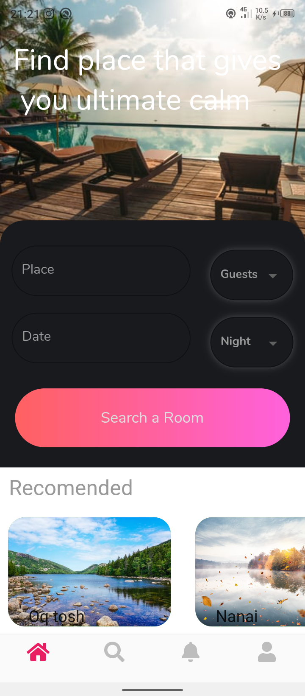
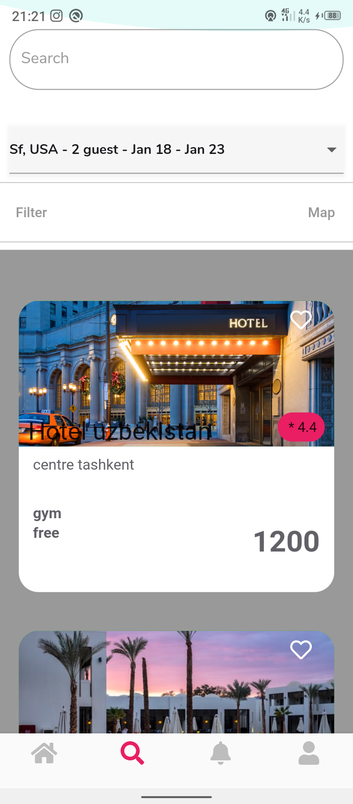
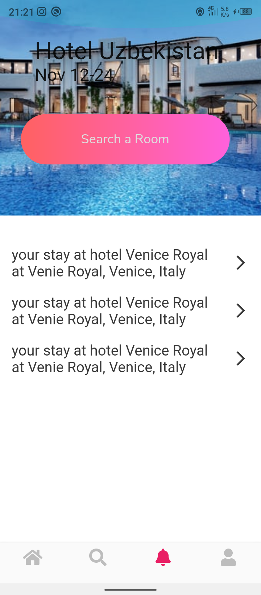
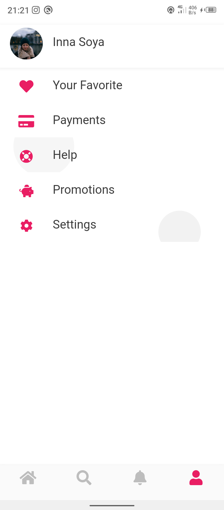
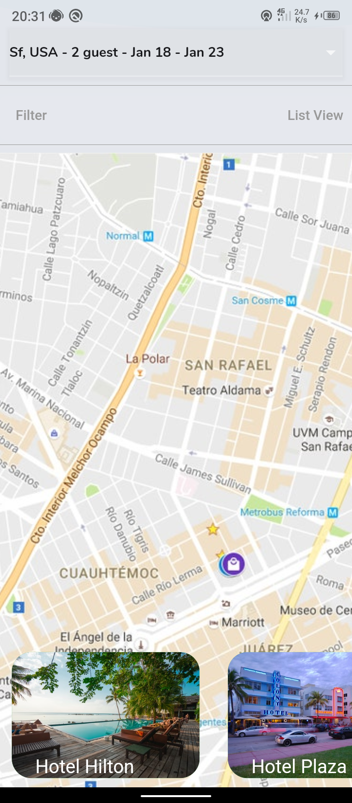
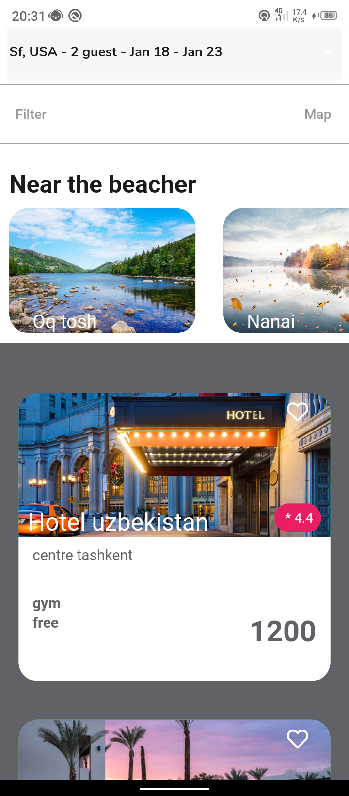
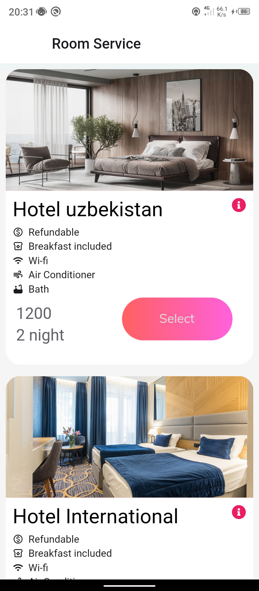
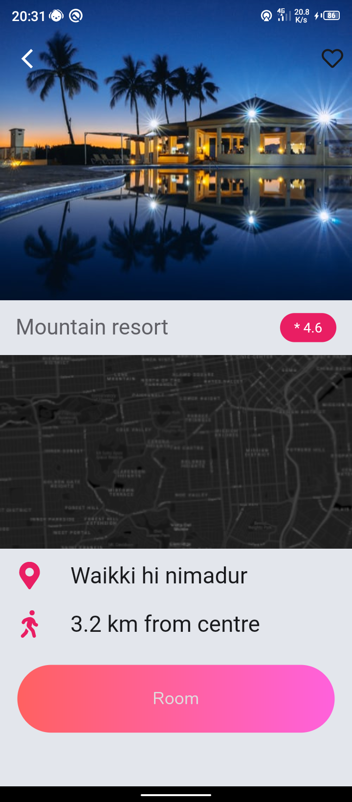
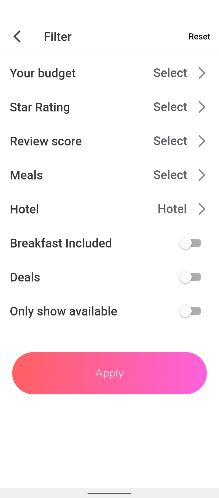

# booking_hotel

<h1>Bu mehmonxonalar uchun app ui va baskend qismini esa nodeJs yordami bilan tayyorlandi qisqa vaqtda tayyorlangani uchun ham chala joylari bo‘lishi mumkin</h1>

<h1>Without extra packages</h1>
<h1>Worked with mvvm</h1>
<h1>Worked with provider</h1>

 
  
  
  

 
  
  
  
  

 
  
   
  

  <a href="./release/app-release.apk?raw=true">Download app now</a>
    
  <a href="https://github.com/ibrokhim-kobilov/booking_hotel_backend">NodeJs file</a>

